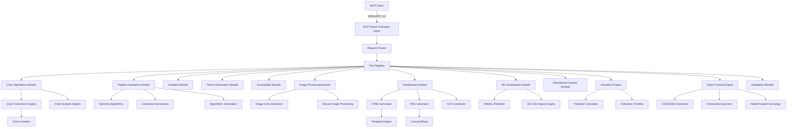

# MCP Color Server - Design Document

## Overview

The MCP Color Server is implemented as a Node.js/TypeScript application using the official MCP SDK. The server follows a modular architecture with separate modules for color operations, palette generation, visualization creation, and MCP protocol handling. The design emphasizes performance, extensibility, and maintainability while providing comprehensive color manipulation capabilities.

## Architecture

### High-Level Architecture



### Core Components

#### 1. MCP Server Foundation

- **Transport Layer**: Handles stdio communication with MCP clients
- **Request Router**: Routes tool calls to appropriate handlers
- **Tool Registry**: Manages tool definitions and validation
- **Error Handler**: Provides consistent error responses

#### 2. Color Engine

- **Color Parser**: Unified color input parsing for all formats
- **Color Converter**: High-precision format conversions
- **Color Analyzer**: Brightness, contrast, temperature analysis
- **Color Validator**: Input validation and sanitization

#### 3. Palette Generation System

- **Harmony Generator**: Color theory-based palette creation
- **Contextual Generator**: Industry/mood-specific palettes
- **Algorithmic Generator**: Mathematical palette algorithms
- **Image Extractor**: Dominant color extraction from images

#### 4. Visualization Engine

- **HTML Generator**: Interactive web-based visualizations
- **PNG Generator**: High-quality static image generation
- **SVG Generator**: Scalable vector graphics for web and print
- **Template System**: Reusable visualization templates
- **Asset Manager**: CSS, JavaScript, and image resources

#### 5. 3D Visualization System

- **WebGL Renderer**: Hardware-accelerated 3D color space rendering
- **3D Color Space Engine**: RGB, HSL, HSV, LAB space visualizations
- **Interactive Controls**: Rotation, zoom, slice plane controls
- **Color Point Mapping**: Position colors in 3D space with relationships

#### 6. Animation Engine

- **Transition Calculator**: Smooth color transitions between states
- **Animation Timeline**: Frame-by-frame animation generation
- **Easing Functions**: Linear, ease, bounce, elastic transitions
- **Color Space Interpolation**: Animations in RGB, HSL, LAB spaces

#### 7. Educational Content System

- **Color Theory Engine**: Interactive color theory demonstrations
- **Accessibility Education**: Inclusive design learning modules
- **Cultural Context**: Color significance and usage information
- **Interactive Tutorials**: Step-by-step color learning experiences

#### 8. Export Format Engine

- **CSS/SCSS Generator**: Modern CSS with custom properties and mixins
- **Framework Exporters**: Tailwind, Swift, Android, Flutter formats
- **Adobe Integration**: ASE (Adobe Swatch Exchange) file generation
- **API Formats**: JSON, XML, and custom format support

#### 9. Image Processing Module

- **Secure Image Handler**: Safe image download and validation
- **Color Extraction Engine**: Multiple algorithms (k-means, median cut, octree)
- **Background Filtering**: Intelligent background color removal
- **Quality Analysis**: Confidence scoring for extracted colors

#### 10. Integration Module

- **RESTful API**: HTTP endpoints for non-MCP integration
- **Webhook Support**: Real-time color update notifications
- **Plugin Architecture**: Custom algorithm and generator support
- **Database Integration**: Persistent storage for user preferences

## Components and Interfaces

### Core Interfaces

```typescript
// Core color representation
interface Color {
  hex: string;
  rgb: { r: number; g: number; b: number; a?: number };
  hsl: { h: number; s: number; l: number; a?: number };
  hsv: { h: number; s: number; v: number; a?: number };
  lab: { l: number; a: number; b: number };
  metadata?: ColorMetadata;
}

interface ColorMetadata {
  brightness: number;
  temperature: "warm" | "cool" | "neutral";
  accessibility: AccessibilityInfo;
  name?: string;
}

// Tool interfaces
interface ColorTool {
  name: string;
  description: string;
  parameters: ToolParameters;
  handler: (params: any) => Promise<ToolResponse>;
}

interface ToolResponse {
  success: boolean;
  data: any;
  metadata: ResponseMetadata;
  visualizations?: {
    html?: string;
    png_base64?: string;
    svg?: string;
  };
  export_formats?: {
    css?: string;
    scss?: string;
    tailwind?: string;
    json?: object;
  };
}
```

### Module Interfaces

#### Color Operations Module

```typescript
interface ColorOperations {
  convertColor(
    color: string,
    outputFormat: string,
    precision?: number
  ): Promise<string>;
  analyzeColor(color: string, analysisTypes: string[]): Promise<ColorAnalysis>;
  calculateDistance(
    color1: string,
    color2: string,
    method: string
  ): Promise<number>;
  mixColors(
    colors: string[],
    ratios?: number[],
    blendMode?: string
  ): Promise<Color>;
  generateVariations(
    baseColor: string,
    type: string,
    steps: number
  ): Promise<Color[]>;
}
```

#### Palette Generation Module

```typescript
interface PaletteGenerator {
  generateHarmonyPalette(
    baseColor: string,
    harmonyType: string,
    count: number
  ): Promise<Palette>;
  generateContextualPalette(
    context: string,
    options: ContextualOptions
  ): Promise<Palette>;
  generateAlgorithmicPalette(
    algorithm: string,
    options: AlgorithmicOptions
  ): Promise<Palette>;
  extractPaletteFromImage(
    imageUrl: string,
    options: ExtractionOptions
  ): Promise<Palette>;
}
```

#### Visualization Module

```typescript
interface VisualizationGenerator {
  createPaletteHTML(palette: Color[], options: HTMLOptions): Promise<string>;
  createColorWheelHTML(options: ColorWheelOptions): Promise<string>;
  createGradientHTML(
    gradient: Gradient,
    options: GradientOptions
  ): Promise<string>;
  createPalettePNG(palette: Color[], options: PNGOptions): Promise<Buffer>;
  createAccessibilityChartHTML(
    combinations: ColorPair[],
    options: AccessibilityOptions
  ): Promise<string>;
  createThemePreviewHTML(
    theme: Theme,
    options: ThemePreviewOptions
  ): Promise<string>;
}
```

#### 3D Visualization Module

```typescript
interface ThreeDVisualizationGenerator {
  create3DColorSpaceHTML(colorSpace: '3d-rgb' | '3d-hsl' | '3d-hsv' | '3d-lab', options: 3DOptions): Promise<string>;
  createColorSpace3D(colors: Color[], colorSpace: string, options: 3DVisualizationOptions): Promise<string>;
  createInteractive3DWheel(options: Interactive3DOptions): Promise<string>;
  generateSlicePlanes(colorSpace: string, sliceType: string, position: number): Promise<string>;
}
```

#### Animation Module

```typescript
interface AnimationGenerator {
  createColorTransitionAnimation(
    fromColor: Color,
    toColor: Color,
    options: AnimationOptions
  ): Promise<AnimationResult>;
  createPaletteTransition(
    fromPalette: Color[],
    toPalette: Color[],
    options: TransitionOptions
  ): Promise<string>;
  generateColorMorphing(
    colors: Color[],
    duration: number,
    easing: string
  ): Promise<AnimationFrames>;
  createInteractiveColorAnimation(
    animationType: string,
    options: InteractiveAnimationOptions
  ): Promise<string>;
}
```

#### Educational Module

```typescript
interface EducationalContentGenerator {
  createColorTheoryDemo(
    theoryType: string,
    baseColor: Color,
    options: EducationalOptions
  ): Promise<string>;
  generateAccessibilityTutorial(
    level: "basic" | "intermediate" | "advanced"
  ): Promise<string>;
  createInteractiveLearning(topic: string, userLevel: string): Promise<string>;
  generateColorHistoryContent(
    color: Color,
    culturalContext?: string
  ): Promise<EducationalContent>;
}
```

#### Export Format Module

```typescript
interface ExportFormatGenerator {
  generateCSS(
    colors: ColorCollection,
    options: CSSExportOptions
  ): Promise<string>;
  generateSCSS(
    colors: ColorCollection,
    options: SCSSExportOptions
  ): Promise<string>;
  generateTailwindConfig(
    colors: ColorCollection,
    options: TailwindOptions
  ): Promise<string>;
  generateSwiftUIColors(colors: ColorCollection): Promise<string>;
  generateAndroidColors(colors: ColorCollection): Promise<string>;
  generateFlutterColors(colors: ColorCollection): Promise<string>;
  generateAdobeASE(colors: ColorCollection): Promise<Buffer>;
  generateCustomFormat(
    colors: ColorCollection,
    format: CustomFormat
  ): Promise<string>;
}
```

#### Image Processing Module

```typescript
interface ImageProcessor {
  extractColorsFromImage(
    imageUrl: string,
    options: ExtractionOptions
  ): Promise<ExtractedPalette>;
  validateImageSafety(imageUrl: string): Promise<ValidationResult>;
  processImageSecurely(
    imageBuffer: Buffer,
    algorithm: ExtractionAlgorithm
  ): Promise<Color[]>;
  analyzeImageColorDistribution(
    imageUrl: string
  ): Promise<ColorDistributionAnalysis>;
}
```

## Data Models

### Color Representation

The system uses a unified Color class that maintains multiple format representations internally for efficient conversion:

```typescript
class UnifiedColor {
  private _hex: string;
  private _rgb: RGB;
  private _hsl: HSL;
  private _lab: LAB;
  private _metadata: ColorMetadata;

  constructor(input: string | ColorObject) {
    // Parse and normalize input
    this.parseInput(input);
    this.calculateAllFormats();
    this.generateMetadata();
  }

  // Format getters
  get hex(): string {
    return this._hex;
  }
  get rgb(): RGB {
    return this._rgb;
  }
  get hsl(): HSL {
    return this._hsl;
  }
  get lab(): LAB {
    return this._lab;
  }

  // Conversion methods
  toFormat(format: string, precision?: number): string;
  toCSSVariable(name: string): string;
  toTailwindClass(type: string): string;
}
```

### Palette Structure

```typescript
interface Palette {
  colors: Color[];
  metadata: {
    type: "harmony" | "contextual" | "algorithmic" | "extracted";
    baseColor?: string;
    harmonyType?: string;
    algorithm?: string;
    context?: string;
    diversity: number;
    harmonyScore: number;
    accessibilityScore: number;
  };
  relationships: ColorRelationship[];
}

interface ColorRelationship {
  fromIndex: number;
  toIndex: number;
  relationship:
    | "complementary"
    | "analogous"
    | "triadic"
    | "split-complementary";
  strength: number;
}
```

### Gradient Model

```typescript
interface Gradient {
  type: "linear" | "radial" | "conic" | "mesh";
  colors: ColorStop[];
  properties: GradientProperties;
}

interface ColorStop {
  color: Color;
  position: number; // 0-100
  opacity?: number;
}

interface LinearGradientProperties {
  angle: number;
  interpolation: "linear" | "ease" | "bezier";
  colorSpace: "rgb" | "hsl" | "lab" | "lch";
}

interface MeshGradientProperties {
  points: MeshPoint[];
  interpolation: "bilinear" | "bicubic";
  resolution: { width: number; height: number };
}

interface MeshPoint {
  x: number; // 0-1
  y: number; // 0-1
  color: Color;
  influence: number; // 0-1
}
```

### Animation Model

```typescript
interface ColorAnimation {
  type: "transition" | "morph" | "sequence" | "interactive";
  duration: number; // milliseconds
  easing: "linear" | "ease" | "ease-in" | "ease-out" | "bounce" | "elastic";
  colorSpace: "rgb" | "hsl" | "lab" | "lch";
  frames: AnimationFrame[];
}

interface AnimationFrame {
  timestamp: number; // 0-1
  colors: Color[];
  metadata?: FrameMetadata;
}

interface ColorTransition {
  fromColor: Color;
  toColor: Color;
  intermediateSteps: number;
  interpolationMethod: "linear" | "bezier" | "spline";
}
```

### 3D Visualization Model

```typescript
interface ColorSpace3D {
  type: "3d-rgb" | "3d-hsl" | "3d-hsv" | "3d-lab";
  dimensions: {
    x: { min: number; max: number; label: string };
    y: { min: number; max: number; label: string };
    z: { min: number; max: number; label: string };
  };
  colors: ColorPoint3D[];
  relationships: ColorRelationship3D[];
}

interface ColorPoint3D {
  color: Color;
  position: { x: number; y: number; z: number };
  size?: number;
  highlighted?: boolean;
}

interface ColorRelationship3D {
  fromPoint: number; // index
  toPoint: number; // index
  relationshipType: string;
  strength: number; // 0-1
}
```

### Educational Content Model

```typescript
interface EducationalContent {
  topic: string;
  level: "beginner" | "intermediate" | "advanced";
  content: {
    theory: string;
    examples: ColorExample[];
    interactiveElements: InteractiveElement[];
    assessments?: Assessment[];
  };
  metadata: {
    estimatedTime: number; // minutes
    prerequisites: string[];
    learningObjectives: string[];
  };
}

interface ColorExample {
  description: string;
  colors: Color[];
  visualization: string; // HTML content
  explanation: string;
}

interface InteractiveElement {
  type: "color-picker" | "slider" | "wheel" | "comparison";
  config: any;
  feedback: string;
}
```

### Export Format Model

```typescript
interface ExportFormat {
  name: string;
  extension: string;
  mimeType?: string;
  generator: (colors: ColorCollection) => Promise<string | Buffer>;
  options?: ExportOptions;
}

interface ColorCollection {
  colors: Color[];
  metadata: {
    name?: string;
    description?: string;
    tags?: string[];
    created: Date;
    modified: Date;
  };
  organization: {
    type: "palette" | "theme" | "gradient" | "collection";
    semanticMapping?: SemanticColorMapping;
  };
}

interface SemanticColorMapping {
  primary?: Color;
  secondary?: Color;
  background?: Color;
  surface?: Color;
  text?: Color;
  accent?: Color;
  success?: Color;
  warning?: Color;
  error?: Color;
  info?: Color;
}
```

## Error Handling

### Error Classification

1. **Input Validation Errors**: Invalid color formats, out-of-range parameters
2. **Processing Errors**: Color conversion failures, algorithm errors
3. **Resource Errors**: Memory limits, file system issues
4. **Network Errors**: Image download failures, external API issues
5. **System Errors**: Unexpected runtime errors

### Error Response Format

```typescript
interface ErrorResponse {
  success: false;
  error: {
    code: string;
    message: string;
    details?: any;
    suggestions?: string[];
  };
  metadata: {
    tool: string;
    timestamp: string;
    executionTime: number;
  };
}
```

### Error Handling Strategy

- **Graceful Degradation**: Provide alternative outputs when primary methods fail
- **Helpful Messages**: Include specific suggestions for fixing input errors
- **Retry Logic**: Automatic retry for transient failures
- **Fallback Options**: Alternative algorithms when preferred methods fail

## Testing Strategy

### Unit Testing

- **Color Conversion Accuracy**: Verify mathematical precision across all formats
- **Palette Generation Logic**: Test color theory algorithms and relationships
- **Input Validation**: Comprehensive testing of edge cases and invalid inputs
- **Performance Benchmarks**: Ensure response time requirements are met

### Integration Testing

- **MCP Protocol Compliance**: Verify JSON-RPC 2.0 message handling
- **End-to-End Workflows**: Test complete user scenarios
- **Visualization Generation**: Validate HTML and PNG output quality
- **Error Handling**: Test error scenarios and recovery

### Visual Testing

- **Palette Accuracy**: Compare generated palettes against design theory
- **Accessibility Compliance**: Verify WCAG contrast calculations
- **Cross-browser Compatibility**: Test HTML visualizations across browsers
- **Image Quality**: Validate PNG generation quality and consistency

### Performance Testing

- **Load Testing**: Concurrent request handling
- **Memory Usage**: Monitor resource consumption under load
- **Response Time**: Verify sub-second response requirements
- **Stress Testing**: Behavior under extreme conditions

## Implementation Approach

### Phase 1: Core Foundation

1. Set up MCP server infrastructure with TypeScript
2. Implement basic color parsing and conversion
3. Create tool registration and request routing
4. Establish error handling patterns

### Phase 2: Color Operations

1. Complete color format conversion system
2. Implement color analysis functions
3. Add color mixing and blending capabilities
4. Create color utility functions

### Phase 3: Palette Generation

1. Implement color harmony algorithms
2. Add contextual palette generation
3. Create algorithmic palette generators
4. Integrate image color extraction with security validation

### Phase 4: Basic Visualization System

1. Build HTML template system
2. Implement interactive color visualizations
3. Create PNG generation pipeline
4. Add accessibility visualization tools

### Phase 5: Advanced Gradient System

1. Complete linear, radial, and conic gradients
2. Implement mesh gradient generation
3. Add advanced color interpolation methods
4. Create gradient animation capabilities

### Phase 6: 3D Visualization and Animation

1. Build WebGL-based 3D color space renderer
2. Implement interactive 3D color wheels and spaces
3. Create color transition animation system
4. Add timeline-based color morphing

### Phase 7: Educational and Export Systems

1. Develop educational content generation
2. Implement comprehensive export format engine
3. Add cultural and historical color context
4. Create interactive learning modules

### Phase 8: Integration and Advanced Features

1. Build RESTful API endpoints
2. Implement webhook and plugin architecture
3. Add database integration for persistence
4. Create comprehensive monitoring and analytics

## Dependencies and Libraries

### Core Dependencies

- `@modelcontextprotocol/sdk`: MCP protocol implementation
- `colord`: High-precision color manipulation
- `chroma-js`: Additional color operations and scales
- `canvas` or `sharp`: PNG image generation
- `jsdom`: HTML processing and manipulation

### Visualization Dependencies

- `d3-color`: Color scales and interpolation
- `color-thief-node`: Image color extraction
- `puppeteer`: HTML to image conversion (alternative)
- `handlebars`: HTML template engine
- `three.js`: 3D visualization and WebGL rendering
- `gsap`: High-performance animation library

### Image Processing Dependencies

- `sharp`: High-performance image processing
- `jimp`: Pure JavaScript image processing (fallback)
- `image-size`: Fast image dimension detection
- `file-type`: Secure file type detection

### Export Format Dependencies

- `css-tree`: CSS parsing and generation
- `sass`: SCSS compilation and generation
- `archiver`: ZIP file creation for export bundles
- `xml2js`: XML format generation

### Educational Content Dependencies

- `markdown-it`: Markdown processing for educational content
- `katex`: Mathematical notation rendering
- `prism`: Code syntax highlighting

### Development Dependencies

- `typescript`: Type safety and development experience
- `jest`: Testing framework
- `eslint`: Code quality and consistency
- `prettier`: Code formatting
- `@types/three`: TypeScript definitions for Three.js
- `@types/gsap`: TypeScript definitions for GSAP

### Security and Validation Libraries

- `joi`: Input validation and sanitization
- `helmet`: Security headers and protection
- `rate-limiter-flexible`: Rate limiting implementation
- `validator`: String validation utilities

### Additional Libraries

- `accessibility-checker`: WCAG compliance validation
- `color-name`: Named color support
- `lru-cache`: Efficient caching implementation
- `ws`: WebSocket support for real-time features
- `express`: HTTP server for REST API endpoints
- `multer`: File upload handling
- `compression`: Response compression

## Security Considerations

### Input Validation

- Strict validation of all color input formats using Joi schemas
- Sanitization of user-provided URLs and file paths
- Parameter bounds checking for numeric inputs
- Prevention of code injection in generated HTML/CSS/JavaScript
- File type validation for image uploads
- Size limits enforcement for all inputs

### Resource Management

- Memory limits for image processing operations (100MB per request)
- Timeout limits for external image downloads (30 seconds)
- Rate limiting for expensive operations (10 requests/minute for 3D visualizations)
- Cleanup of temporary files and resources
- WebGL context management and cleanup
- Animation frame cleanup and memory management

### Output Safety

- XSS prevention in generated HTML content using CSP headers
- Safe CSS generation without executable code
- Validation of generated image data and file headers
- Secure handling of base64 encoded content
- SVG sanitization to prevent embedded scripts
- WebGL shader validation for 3D visualizations

### API Security

- Authentication and authorization for REST endpoints
- CORS configuration for web-based integrations
- Request signing for webhook notifications
- Secure storage of user preferences and data
- Audit logging for security-relevant operations

### Educational Content Security

- Sanitization of user-generated educational content
- Safe rendering of mathematical notation
- Validation of interactive element configurations
- Prevention of malicious code in learning modules

## Performance Optimization

### Caching Strategy

- Color conversion result caching with LRU eviction
- Palette generation memoization based on input parameters
- Template compilation caching for HTML/SVG generation
- Image processing result caching with content-based keys
- 3D visualization geometry caching
- Animation frame caching for repeated transitions
- Educational content caching with versioning

### Resource Optimization

- Lazy loading of heavy dependencies (Three.js, GSAP)
- Streaming for large image operations
- Memory-efficient color calculations using typed arrays
- Optimized PNG compression with configurable quality
- WebGL resource pooling and reuse
- Efficient SVG generation with minimal DOM manipulation
- Background processing for expensive operations

### Scalability Considerations

- Stateless server design for horizontal scaling
- Efficient memory usage patterns with garbage collection hints
- Minimal external dependencies with optional feature loading
- Fast startup and shutdown procedures
- Connection pooling for database operations
- Distributed caching support (Redis compatibility)
- Load balancing support for multiple server instances

### Performance Monitoring

- Real-time performance metrics collection
- Memory usage tracking and alerting
- Response time monitoring per tool
- Cache hit rate optimization
- WebGL performance profiling
- Animation frame rate monitoring
- Resource cleanup verification
